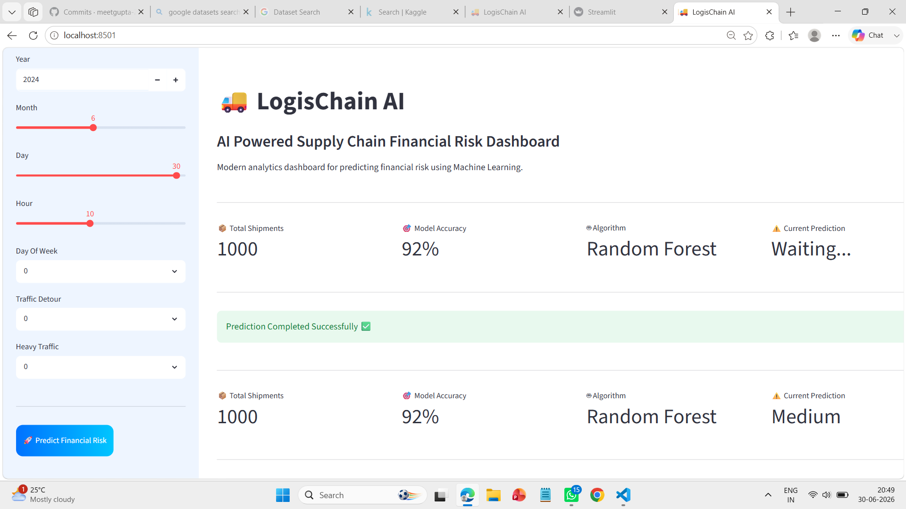
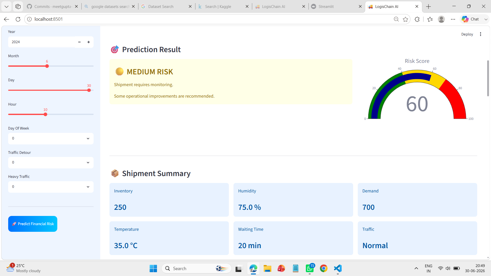
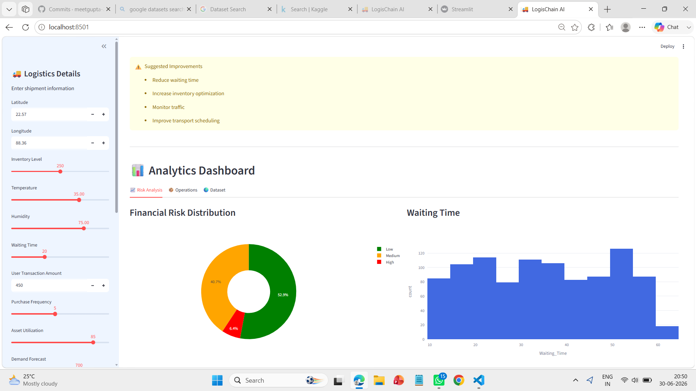
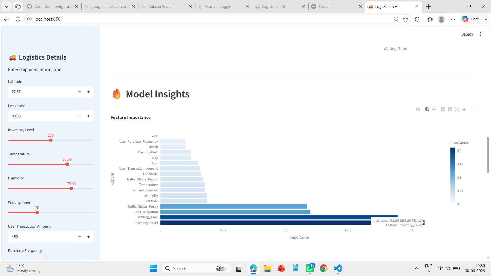
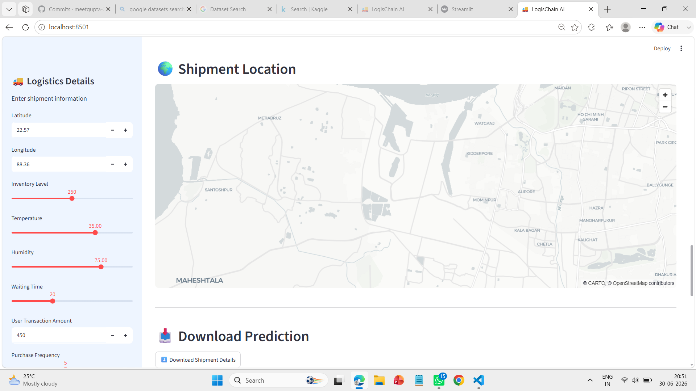
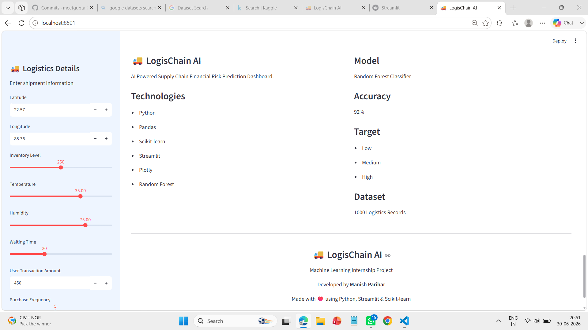

LogisChain-AI

## AI-Powered Supply Chain Financial Risk Prediction Dashboard

LogisChain-AI is a Machine Learning-powered dashboard that predicts the financial risk associated with logistics and supply chain operations.

The project combines *Data Analysis, **Feature Engineering, **Machine Learning, and **Interactive Visualization* to help businesses estimate shipment risk and make better operational decisions.

---

# 📌 Problem Statement

Supply chain companies face financial losses due to delays, inventory issues, traffic conditions, weather, and operational inefficiencies.

This project predicts the financial risk level of a shipment using historical logistics data and provides analytics to support better decision-making.

---

# ✨ Features

- 🤖 Financial Risk Prediction
- 📊 Interactive Analytics Dashboard
- 📈 Feature Importance Visualization
- 🎯 Risk Score Gauge
- 🗺️ Shipment Location Map
- 📉 Dataset Analytics
- 💡 AI Recommendations
- 📥 Download Prediction as CSV
- 📋 Current Shipment Summary
- 🎨 Modern Streamlit Dashboard

---

# 📷 Dashboard Preview

## 🏠 Home Dashboard

---

## 🎯 Prediction Result

---

## 📊 Analytics Dashboard

---

## 🔥 Model Insights

---

## 🗺️ Shipment Location

---

## 📄 Project Information

# ⚙️ Machine Learning Pipeline

Raw Dataset
      │
      ▼
Data Cleaning
      │
      ▼
Feature Engineering
      │
      ▼
Train-Test Split
      │
      ▼
Random Forest Classifier
      │
      ▼
Financial Risk Prediction
      │
      ▼
Interactive Dashboard

---

# 📂 Dataset

Dataset contains logistics shipment records including:

- Latitude
- Longitude
- Inventory Level
- Temperature
- Humidity
- Waiting Time
- User Transaction Amount
- Purchase Frequency
- Asset Utilization
- Demand Forecast
- Date Features
- Traffic Conditions

### Target Variable

Financial Risk

- Low
- Medium
- High

---

# 🤖 Machine Learning Model

Algorithm Used

- Random Forest Classifier

Reason for Selection

- High Accuracy
- Handles Non-linear Relationships
- Robust to Noise
- Good Feature Importance
- Works Well on Tabular Data

Model Accuracy

*92%*

---

# 📊 Dashboard Components

### KPI Cards

- Total Shipments
- Model Accuracy
- Algorithm Used
- Current Prediction

### Charts

- Financial Risk Distribution
- Waiting Time Distribution
- Feature Importance Chart

### Visual Components

- Risk Gauge
- Shipment Map
- Recommendation Panel
- Dataset Preview

---

# 🛠️ Tech Stack

### Programming Language

- Python

### Libraries

- Pandas
- NumPy
- Scikit-learn
- Plotly
- Streamlit
- Joblib

---

# 📁 Project Structure

LogisChain-AI
│
├── dashboard/
│   └── app.py
│
├── data/
│   ├── Financial_Risk_Dataset.csv
│   ├── Processed_dataset.csv
│   └── smart_logistics_dataset.csv
│
├── models/
│   ├── financial_risk_model.pkl
│   ├── label_encoder.pkl
│   ├── logistic_model.py
│   └── random_forest_model.py
│
├── notebooks/
│
├── docs/
│
├── feature_engineering/
│
├── simulation/
│
├── src/
│
├── README.md
└── LICENSE

---

# 🚀 Installation

Clone the repository

bash
git clone https://github.com/yourusername/LogisChain-AI.git

Go inside project

bash
cd LogisChain-AI

Install dependencies

bash
pip install -r requirements.txt

Run the dashboard

bash
streamlit run dashboard/app.py

---

# 💻 How to Use

1. Open the dashboard.
2. Enter shipment details.
3. Click *Predict Financial Risk*.
4. View prediction results.
5. Analyze charts and insights.
6. Download shipment details as CSV.

---

# 📈 Future Improvements

- Real-time Shipment Tracking
- Live Weather API
- Traffic API Integration
- Explainable AI (SHAP)
- Deep Learning

# 👨‍💻 Author

*Manish Parihar*

B.Tech Computer Science Engineering

Machine Learning & Data Science Enthusiast

---

# 📄 License

This project is licensed under the MIT License.

---

# ⭐ If you found this project useful

Give this repository a ⭐ on GitHub